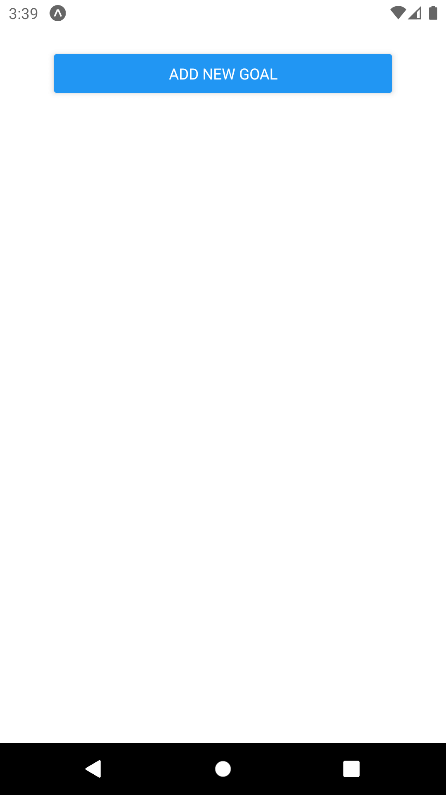
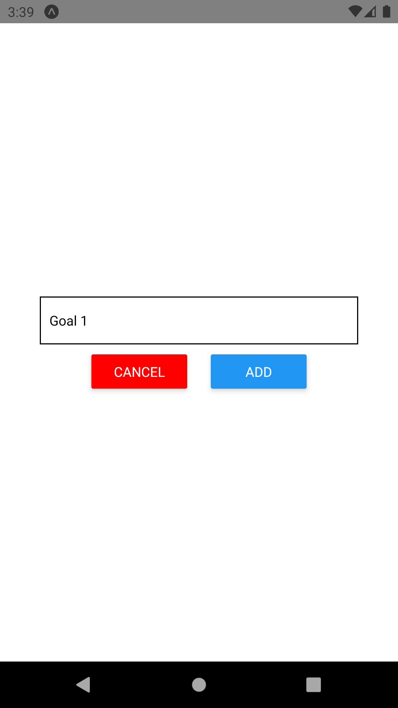
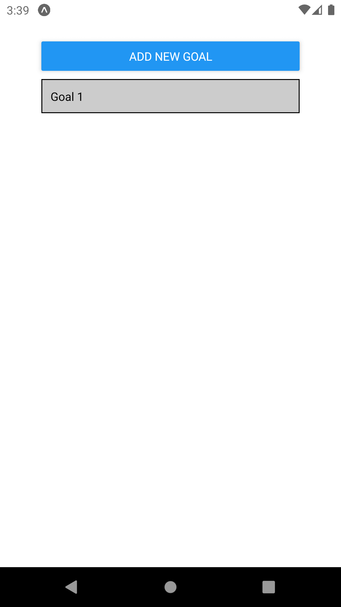

# Goals App

<h1 align="center">
    
    
    
</h1>

## 💻 Projeto

Nesse projeto você adiciona um objetivo, quando finalizar pressiona ele para desaparecer.

## :rocket: Tecnologias

Esse projeto foi desenvolvido com as seguintes tecnologias:

- [React Native](https://reactnative.dev)
- [Expo](https://expo.io/)

## 🔨 Como usar

Para clonar essa aplicação, você vai precisar de [Git](https://git-scm.com/), Node.js v12+ e [Yarn](https://yarnpkg.com/) instalado.

### Iniciar Aplicação

```bash
# Diretório da API
cd 1-goals-app

# Instalar dependências
yarn install

# Iniciar aplicação expo
yarn start
```
