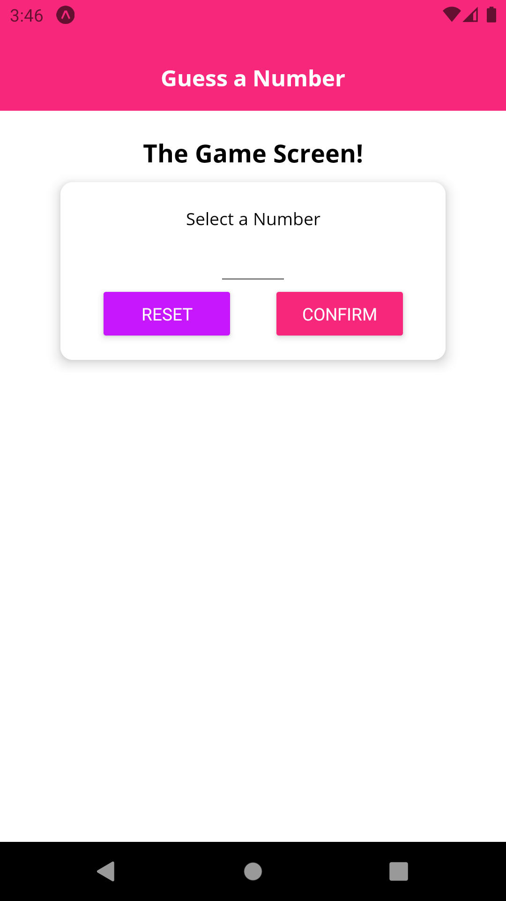
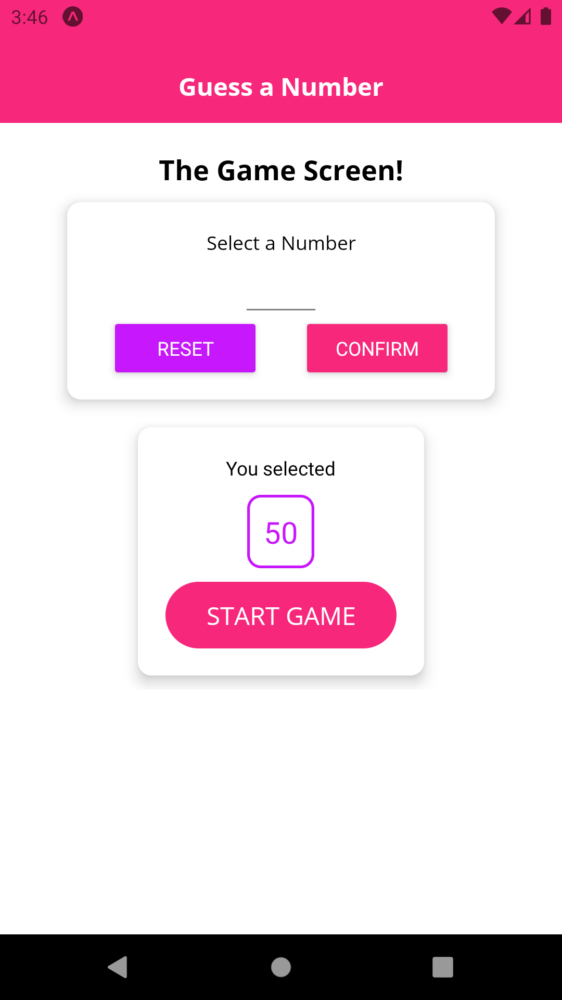
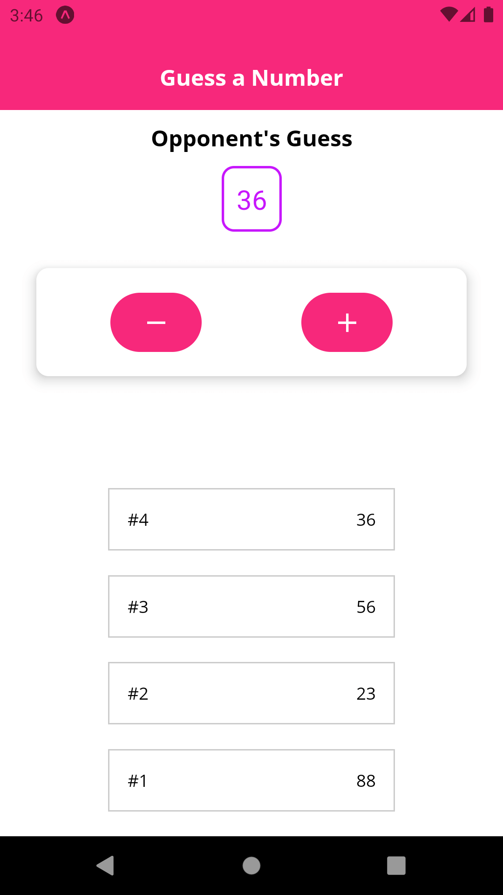
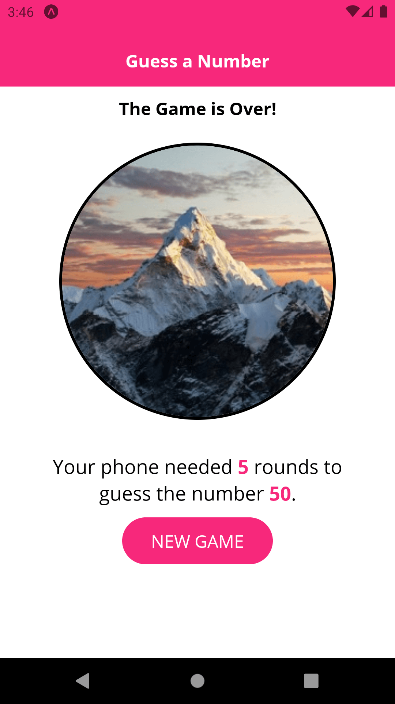
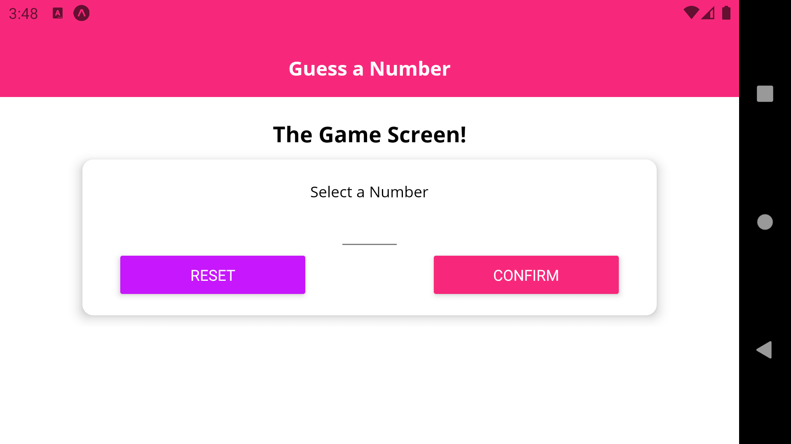
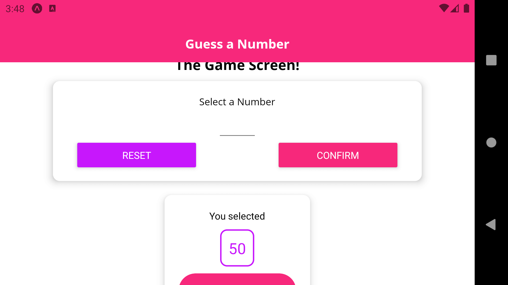
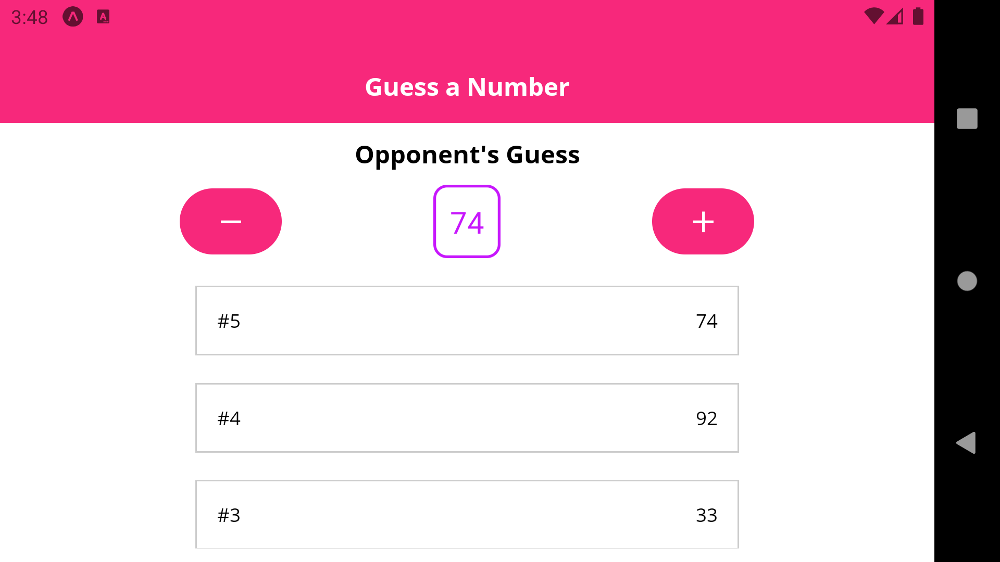
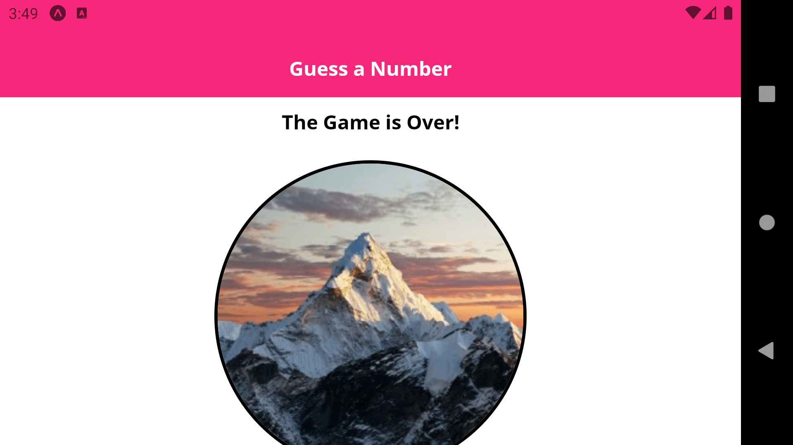

# Guess Number App

<h1 align="center">
    
    
    
    
</h1>

<h1 align="center">
    
    
    
    
</h1>

## 💻 Projeto

Nesse projeto você escolhe um número, e pressiona no botão de (-) ou (+) dependendo se a opção do oponente é maior ou menor que seu número escolhido.

## :rocket: Tecnologias

Esse projeto foi desenvolvido com as seguintes tecnologias:

- [React Native](https://reactnative.dev)
- [Expo](https://expo.io/)
- [Expo Fonts](https://docs.expo.io/versions/latest/sdk/font/)
- [Expo Screen Orientation](https://docs.expo.io/versions/latest/sdk/screen-orientation/)

## 🔨 Como usar

Para clonar essa aplicação, você vai precisar de [Git](https://git-scm.com/), Node.js v12+ e [Yarn](https://yarnpkg.com/) instalado.

### Iniciar Aplicação

```bash
# Diretório da API
cd 2-guess-number-app

# Instalar dependências
yarn install

# Iniciar aplicação expo
yarn start
```

## :memo: Licença

Esse projeto está sob a licença MIT. Veja o arquivo [LICENSE](LICENSE.md) para mais detalhes.
