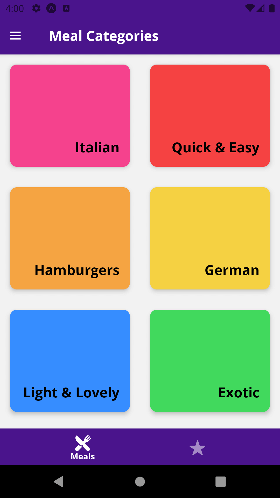
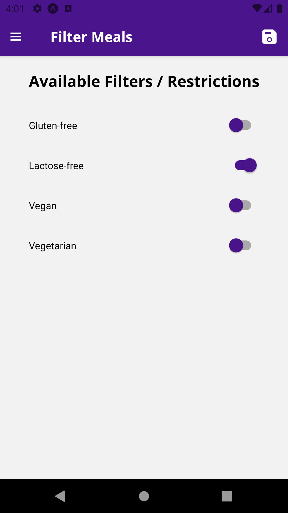
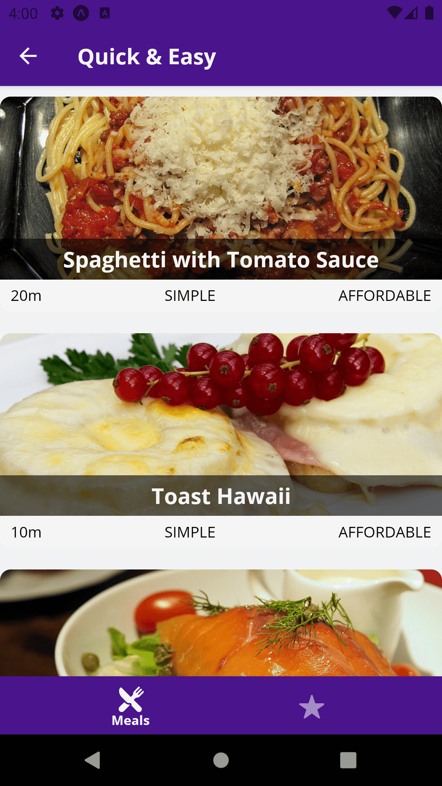
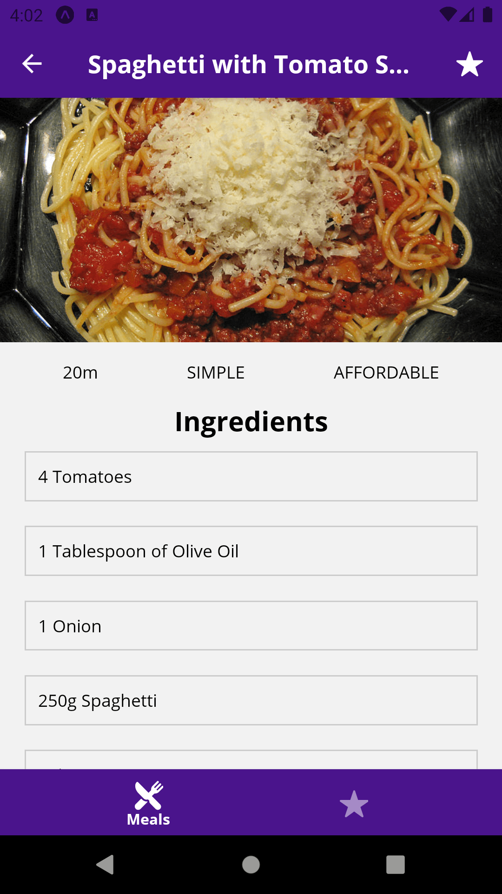
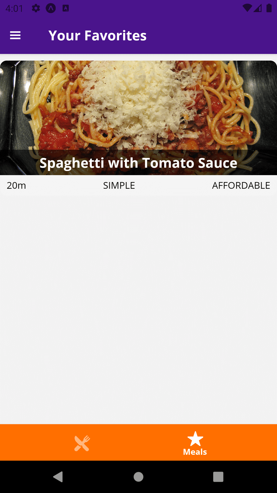

# Meals App

<h1 align="center">
    
    
    
    
    
    
</h1>

## 💻 Projeto

Nesse projeto você navega entre as categorias de refeições, filtra as refeições, visualiza os ingredientes e modo de fazer, favorita uma refeição, e visualiza todas as refeições favoritadas.

## :rocket: Tecnologias

Esse projeto foi desenvolvido com as seguintes tecnologias:

- [React Native](https://reactnative.dev)
- [Expo](https://expo.io/)
- [Expo Fonts](https://docs.expo.io/versions/latest/sdk/font/)
- [Redux](https://redux.js.org)
- [React Navigation v4.x](https://reactnavigation.org/docs/4.x/getting-started)

## 🔨 Como usar

Para clonar essa aplicação, você vai precisar de [Git](https://git-scm.com/), Node.js v12+ e [Yarn](https://yarnpkg.com/) instalado.

### Iniciar Aplicação

```bash
# Diretório da API
cd 3-meals-app

# Instalar dependências
yarn install

# Iniciar aplicação expo
yarn start
```
