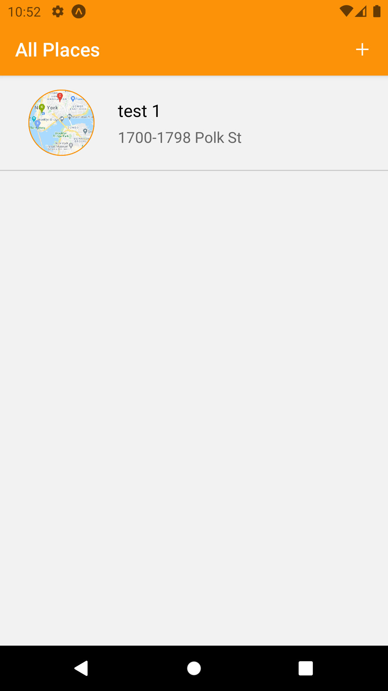

# Great Places

<h1 align="center">
    
    
    
    
</h1>

## 💻 Projeto

Nesse projeto você lista os lugares, no cadastro você coloca um título, tira uma foto e coloca uma localização, seja por local do usuário ou por local selecionado no mapa.

## :rocket: Tecnologias

Esse projeto foi desenvolvido com as seguintes tecnologias:

- [React Native](https://reactnative.dev)
- [Expo](https://expo.io/)
- [Redux](https://redux.js.org)
- [Redux Thunk](https://github.com/reduxjs/redux-thunk)
- [React Navigation v4.x](https://reactnavigation.org/docs/4.x/getting-started)
- [Expo File System](https://docs.expo.io/versions/latest/sdk/filesystem/)
- [Expo Image Picker](https://docs.expo.io/versions/latest/sdk/imagepicker/)
- [Expo Location](https://docs.expo.io/versions/latest/sdk/location/)
- [Expo Permissions](https://docs.expo.io/versions/latest/sdk/permissions/)
- [Expo SQLite](https://docs.expo.io/versions/latest/sdk/sqlite/)
- [React Native Maps](https://github.com/react-native-maps/react-native-maps)

## 🔨 Como usar

Para clonar essa aplicação, você vai precisar de [Git](https://git-scm.com/), Node.js v12+ e [Yarn](https://yarnpkg.com/) instalado.

### Iniciar Aplicação

```bash
# Diretório da API
cd 4-shop-app

# Instalar dependências
yarn install

# Iniciar aplicação expo
yarn start
```

# Building Apps without Expo

## Expo - Managed Workflow

```bash
expo init project
```

## Expo Bare Workflow

```bash
# https://docs.expo.io/bare/hello-world/
expo init RNWithExpoBare

> minimal
```

## React Native CLI

```bash
# https://reactnative.dev/docs/environment-setup
npm install -g react-native-cli

react-native init project

npx react-native run-android
```

# Publish & Build

## Expo

- https://docs.expo.io/distribution/building-standalone-apps/?redirected
- https://docs.expo.io/guides/splash-screens/
- https://docs.expo.io/distribution/uploading-apps/#creating-a-google-service-account

```bash
expo publish

# android
expo build:android -t app-bundle

# ios
expo build:ios

expo fetch:android:keystore
```
