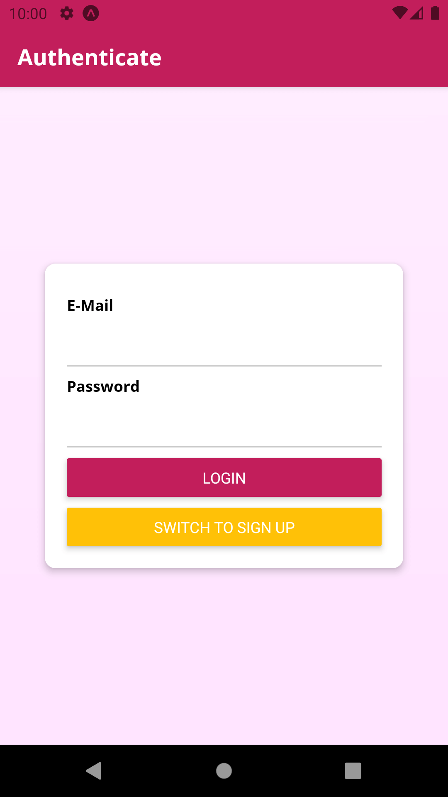
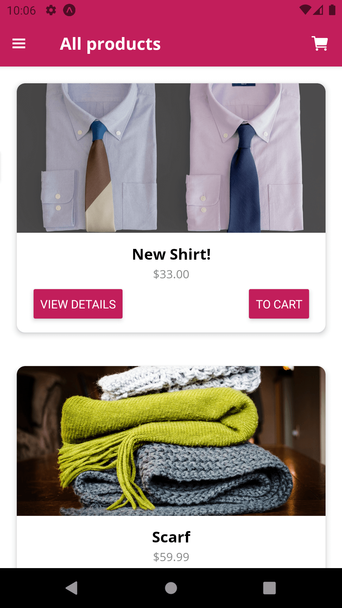
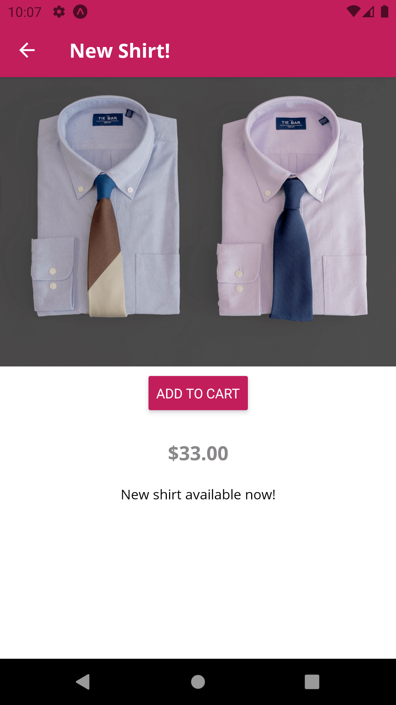
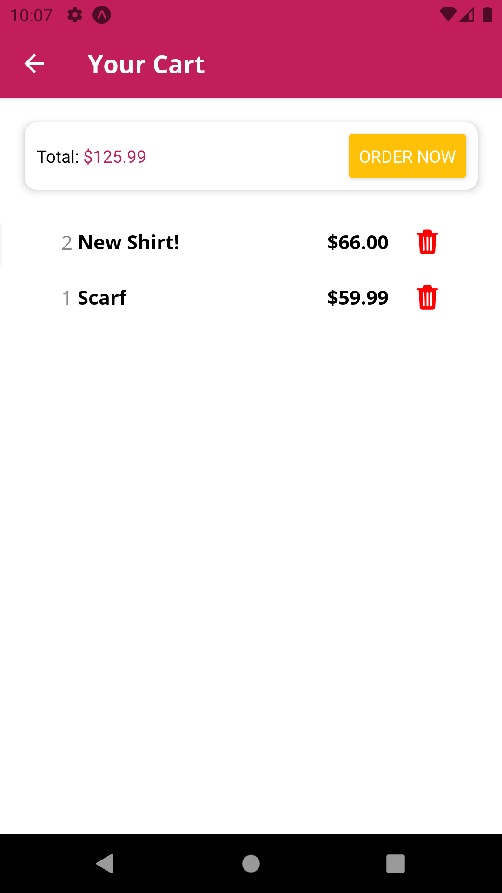
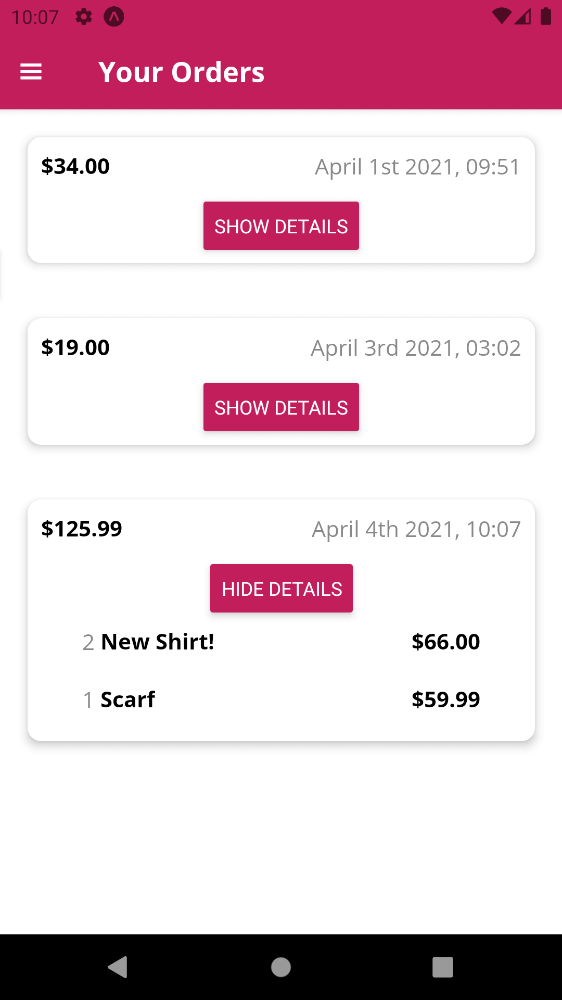
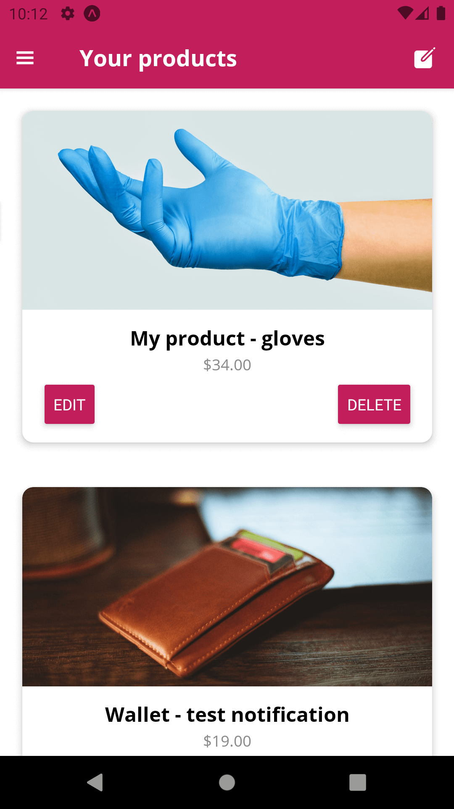
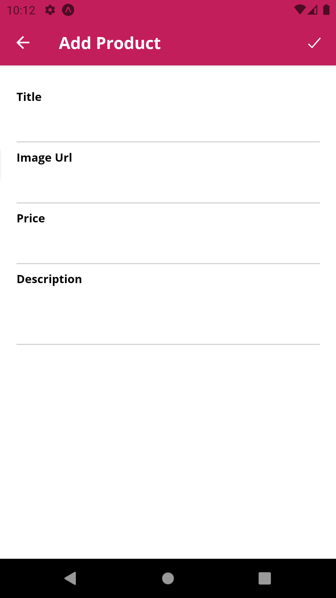

# Shop App - React Navigation v5.x

<h1 align="center">
    
    
    
    
    
    
    
</h1>

## 💻 Projeto

Nesse projeto você visualiza todos os produtos e detalhes, adiciona no carrinho, e faz o pedido. Em admin você pode adiciona, edita e exclui o seu produto.

O projeto foi atualizado com a versão 5 do React Navigation, depois foi atualizado para utilizar push notification.

## :rocket: Tecnologias

Esse projeto foi desenvolvido com as seguintes tecnologias:

- [React Native](https://reactnative.dev)
- [Expo](https://expo.io/)
- [Expo Fonts](https://docs.expo.io/versions/latest/sdk/font/)
- [Redux](https://redux.js.org)
- [Redux Thunk](https://github.com/reduxjs/redux-thunk)
- [React Navigation v5.x](https://reactnavigation.org/docs/getting-started)
- [Async Storage](https://react-native-async-storage.github.io/async-storage/docs/usage/)
- [Firebase](https://firebase.google.com/?hl=pt-br)
- [Expo Permissions](https://docs.expo.io/versions/latest/sdk/permissions/)
- [Expo Notifications](https://docs.expo.io/versions/latest/sdk/notifications/)

## 🔨 Como usar

Para clonar essa aplicação, você vai precisar de [Git](https://git-scm.com/), Node.js v12+ e [Yarn](https://yarnpkg.com/) instalado.

### Iniciar Aplicação

```bash
# Diretório da API
cd 6-shop-app-react-navigation-v5

# Instalar dependências
yarn install

# Iniciar aplicação expo
yarn start
```
